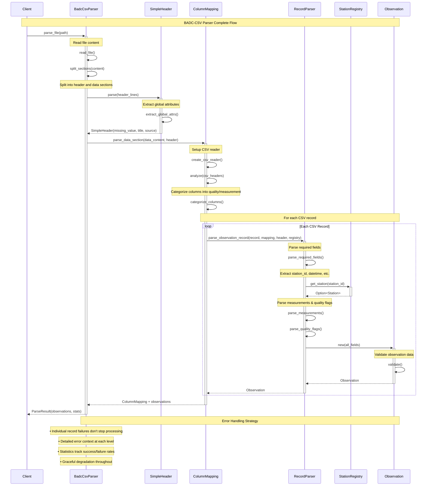
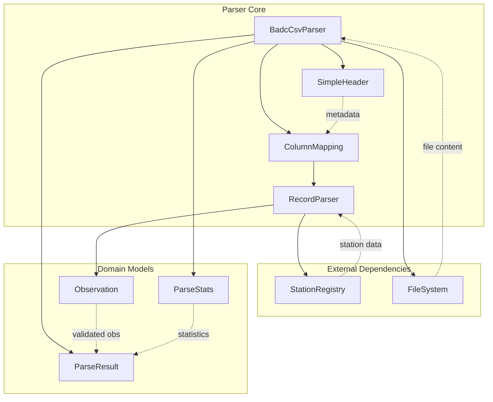
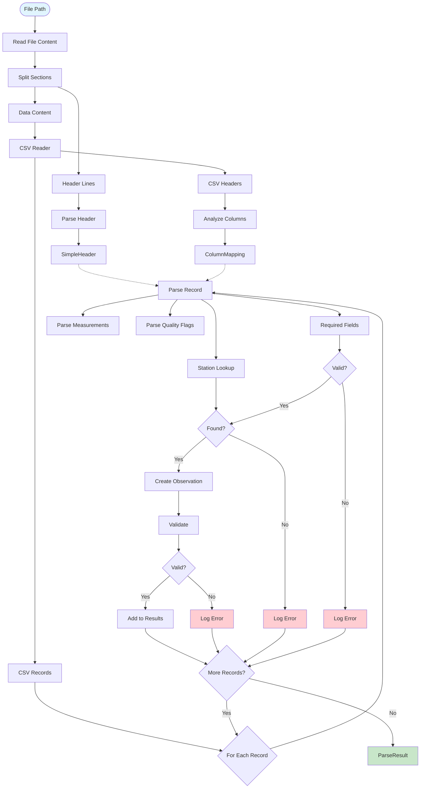

# BADC-CSV Parser Mermaid Sequence Diagram

This document shows the complete execution flow of the MIDAS BADC-CSV parser using Mermaid sequence diagram format.

## Components

- **Client** - Code calling the parser (e.g., CLI commands)
- **BadcCsvParser** - Main parser orchestrator
- **SimpleHeader** - BADC-CSV header metadata extractor
- **ColumnMapping** - Dynamic column analysis and categorization
- **RecordParser** - Individual CSV record processing
- **StationRegistry** - O(1) station metadata lookup service
- **Observation** - Domain model with validation

## Mermaid Sequence Diagram



## Alternative Detailed View with Error Handling

```mermaid
sequenceDiagram
    participant C as Client
    participant P as BadcCsvParser
    participant H as SimpleHeader
    participant CM as ColumnMapping
    participant RP as RecordParser
    participant SR as StationRegistry
    participant O as Observation

    Note over C,O: Detailed Flow with Error Handling

    C->>+P: parse_file(path)

    alt File exists and readable
        P->>P: read_file() ✓
        P->>P: split_sections() ✓

        alt Has "data" marker
            P->>+H: parse(header_lines)
            H->>H: extract_global_attrs()
            H-->>-P: SimpleHeader ✓

            P->>+CM: parse_data_section()
            CM->>CM: create_csv_reader() ✓
            CM->>CM: analyze_headers() ✓

            loop Each Record
                CM->>+RP: parse_observation_record()

                alt Valid record format
                    RP->>RP: parse_required_fields() ✓
                    RP->>+SR: get_station(station_id)

                    alt Station found
                        SR-->>-RP: Station ✓
                        RP->>RP: parse_measurements() ✓
                        RP->>RP: parse_quality_flags() ✓
                        RP->>+O: new()

                        alt Validation passes
                            O->>O: validate() ✓
                            O-->>-RP: Observation ✓
                        else Validation fails
                            O-->>-RP: ValidationError ❌
                            Note over RP: Log error, increment stats
                        end
                    else Station not found
                        SR-->>-RP: None ❌
                        Note over RP: Log error, increment stats
                    end
                else Invalid record
                    Note over RP: Parse error ❌
                    Note over RP: Log error, increment stats
                end

                RP-->>-CM: Result<Observation>
            end

            CM-->>-P: ParseResult ✓
        else No "data" marker
            Note over P: Format error ❌
            P-->>C: Error::BadcFormat
        end
    else File not readable
        Note over P: I/O error ❌
        P-->>C: Error::Io
    end

    P-->>-C: Result<ParseResult>
```

## Component Interaction Overview



## Key Data Structures Flow



## Performance Characteristics

```mermaid
graph LR
    subgraph "Time Complexity"
        F[File Read: O(n)]
        H[Header Parse: O(h)]
        C[Column Map: O(c)]
        R[Records: O(r)]
        S[Station Lookup: O(1)]
        V[Validation: O(1)]
    end

    subgraph "Space Complexity"
        M[Memory: O(n + r)]
        B[Buffer: O(record_size)]
        I[Indexes: O(stations)]
    end

    F --> H --> C --> R
    R --> S --> V

    style S fill:#c8e6c9
    style V fill:#c8e6c9
```

## Usage Example

To render these diagrams:

1. **GitHub/GitLab**: Diagrams render automatically in markdown
2. **VS Code**: Install Mermaid Preview extension
3. **Online**: Use [mermaid.live](https://mermaid.live) to visualize
4. **CLI**: Use `mermaid-cli` to generate images

```bash
# Generate PNG from markdown
mmdc -i csv-parser-mermaid-diagram.md -o parser-diagram.png
```

## Error Handling Strategy

The parser implements comprehensive error handling:

- **File Level**: I/O errors, missing files
- **Format Level**: Invalid BADC-CSV structure
- **Record Level**: Malformed CSV records
- **Data Level**: Invalid field values
- **Validation Level**: Business rule violations

All errors are captured with context while processing continues for maximum data recovery.
