# Parquet Writer Module - Sequence Diagram

This document provides a comprehensive sequence diagram showing the interaction flow within the MIDAS Processor's parquet_writer module during the process of converting weather observations to optimized Parquet files.

## Overview

The parquet_writer module transforms MIDAS weather observations into high-performance Parquet files with the following key features:
- Memory-efficient streaming processing
- Dynamic schema generation based on measurement data
- Progress reporting and statistics tracking
- Pandas-compatible output format
- Query optimization features

## Sequence Diagram

```mermaid
sequenceDiagram
    participant CLI as CLI Commands
    participant Utils as Utility Functions
    participant Writer as ParquetWriter
    participant Config as WriterConfig
    participant Schema as Schema Factory
    participant Conversion as Data Converter
    participant Progress as ProgressReporter
    participant Arrow as ArrowWriter
    participant FS as File System

    Note over CLI,FS: Parquet Writer Module Workflow

    %% Configuration and Setup Phase
    CLI->>Config: Create WriterConfig
    Config->>Config: validate()
    Config-->>CLI: Validated config

    CLI->>Utils: create_optimized_writer(path, estimated_size)
    Utils->>Config: Optimize config based on data size
    Config-->>Utils: Optimized WriterConfig

    Utils->>Writer: ParquetWriter::new(path, config)
    Writer->>Schema: create_weather_schema()
    Schema-->>Writer: Base schema (no measurements)
    Writer->>Progress: ProgressReporter::new()
    Progress-->>Writer: Progress reporter instance
    Writer-->>Utils: ParquetWriter instance
    Utils-->>CLI: Ready writer

    %% Progress Setup
    CLI->>Writer: setup_progress(total_observations)
    Writer->>Progress: setup_progress(total)
    Progress->>Progress: Create progress bar with styling
    Progress-->>Writer: Progress bar configured

    %% First Write - Schema Initialization
    CLI->>Writer: write_observations(observations)
    
    Note over Writer,Schema: First write triggers schema initialization
    Writer->>Writer: initialize_schema(sample_observations)
    Writer->>Schema: extend_schema_with_measurements(base_schema, observations)
    
    loop For each observation
        Schema->>Schema: collect_measurement_names()
        Schema->>Schema: Create measurement fields (Float64)
        Schema->>Schema: Create quality flag fields (Utf8, q_* prefix)
    end
    
    Schema->>Schema: Sort measurement names for consistency
    Schema-->>Writer: Extended schema with dynamic fields

    Writer->>Writer: create_arrow_writer()
    Writer->>FS: create_dir_all(parent_directory)
    FS-->>Writer: Directory created
    Writer->>FS: File::create(output_path)
    FS-->>Writer: File handle
    
    Writer->>Config: create_writer_properties()
    Config->>Config: Configure compression, row groups, page sizes
    Config-->>Writer: WriterProperties
    
    Writer->>Arrow: ArrowWriter::try_new(file, schema, properties)
    Arrow-->>Writer: ArrowWriter instance
    
    Writer->>Writer: schema_initialized = true

    %% Batch Processing Loop
    Writer->>Writer: Add observations to buffer
    
    loop While buffer >= batch_size
        Writer->>Writer: Extract batch from buffer
        Writer->>Writer: write_batch(batch_observations)
        
        Writer->>Conversion: observations_to_record_batch(observations, schema)
        
        loop For each field in schema
            alt Base field (timestamps, station info)
                Conversion->>Conversion: create_timestamp_array() / create_string_array()
            else Measurement field
                Conversion->>Conversion: create_optional_float64_array()
            else Quality flag field  
                Conversion->>Conversion: create_optional_string_array()
            end
        end
        
        Conversion->>Conversion: Validate field lengths match
        Conversion-->>Writer: RecordBatch
        
        Writer->>Arrow: write(record_batch)
        Arrow-->>Writer: Batch written
        
        Writer->>Writer: Update statistics (observations_written++, batches_written++)
        Writer->>Progress: increment(batch_size)
        Progress->>Progress: Update progress bar
        Writer->>Progress: update_with_stats(stats)
        Progress->>Progress: Display memory usage, batch count
        
        %% Memory Management Check
        Writer->>Arrow: in_progress_size()
        Arrow-->>Writer: Current memory usage
        
        alt Memory usage > limit
            Writer->>Writer: flush_memory()
            Writer->>Arrow: flush()
            Arrow-->>Writer: Memory flushed
            Writer->>Writer: stats.memory_flushes++
        end
    end

    %% Subsequent Writes (Schema already initialized)
    CLI->>Writer: write_observations(more_observations)
    Note over Writer: Schema already initialized, skip to buffering
    Writer->>Writer: Add to buffer and process batches
    
    %% Multiple Dataset Processing (Optional)
    alt Multiple Datasets
        CLI->>Utils: write_multiple_datasets_to_parquet(datasets)
        
        loop For each dataset
            Utils->>Utils: write_dataset_to_parquet(name, observations, config)
            Utils->>Writer: Create new writer for dataset
            Utils->>Writer: write_observations(dataset_observations)
            Utils->>Writer: finalize()
            Writer-->>Utils: WritingStats
        end
        
        Utils->>Utils: generate_writing_summary(all_stats)
        Utils-->>CLI: Summary report
    end

    %% Finalization Phase
    CLI->>Writer: finalize()
    
    alt Buffer not empty
        Writer->>Writer: write_batch(remaining_observations)
        Writer->>Conversion: observations_to_record_batch()
        Conversion-->>Writer: Final RecordBatch
        Writer->>Arrow: write(final_batch)
    end
    
    Writer->>Arrow: close()
    Arrow->>FS: Write metadata, close file
    FS-->>Arrow: File closed
    Arrow-->>Writer: Writer closed
    
    Writer->>FS: metadata(output_path)
    FS-->>Writer: File metadata
    Writer->>Writer: stats.bytes_written = file_size
    
    Writer->>Progress: finish(stats)
    Progress->>Progress: Display completion message
    Progress-->>Writer: Progress completed
    
    Writer-->>CLI: WritingStats (final statistics)

    %% Validation Phase (Optional)
    CLI->>Utils: validate_parquet_file(output_path)
    Utils->>FS: Check file exists and size > 0
    FS-->>Utils: File validation
    Utils-->>CLI: ParquetFileInfo

    Note over CLI,FS: Parquet file generation complete with statistics
```

## Key Components

### 1. **WriterConfig**
- Manages compression settings, memory limits, batch sizes
- Validates configuration parameters
- Provides builder pattern for easy customization

### 2. **Schema Factory**
- Creates base weather observation schema
- Dynamically extends schema based on actual measurement data
- Ensures pandas compatibility with proper data types

### 3. **Data Conversion**
- Transforms Rust structs to Arrow arrays
- Handles nullable fields appropriately
- Maintains type safety throughout conversion

### 4. **Memory Management**
- Monitors memory usage during writing
- Triggers flushes when limits are exceeded
- Prevents OOM conditions on large datasets

### 5. **Progress Reporting**
- Real-time progress bars with statistics
- Memory usage and batch processing metrics
- Completion summaries

## Data Flow Patterns

### Schema Evolution
1. **Base Schema**: Fixed fields (timestamps, station metadata)
2. **Dynamic Extension**: Measurement fields discovered from data
3. **Type Mapping**: Float64 for measurements, Utf8 for quality flags
4. **Validation**: Ensures schema consistency

### Memory Efficiency
1. **Streaming Processing**: Data processed in configurable batches
2. **Buffer Management**: Observations buffered until batch size reached
3. **Memory Monitoring**: Automatic flushes when memory limits exceeded
4. **Resource Cleanup**: Proper file handle and memory management

### Error Handling
- Configuration validation before processing
- Schema validation during extension
- Memory allocation error handling
- File I/O error propagation with context

## Performance Optimizations

1. **Row Group Sizing**: Optimized for query performance
2. **Compression**: Snappy compression for fast decompression
3. **Dictionary Encoding**: Automatic for categorical data
4. **Statistics**: Column statistics for predicate pushdown
5. **Batch Processing**: Configurable batch sizes for memory/performance balance

## Integration Points

- **CLI Commands**: High-level orchestration
- **Record Processor**: Source of processed observations
- **File System**: Output directory management
- **Arrow/Parquet**: Low-level file format handling

This sequence diagram illustrates the complete workflow from configuration through finalization, showing how the various components interact to produce optimized Parquet files from MIDAS weather observations.